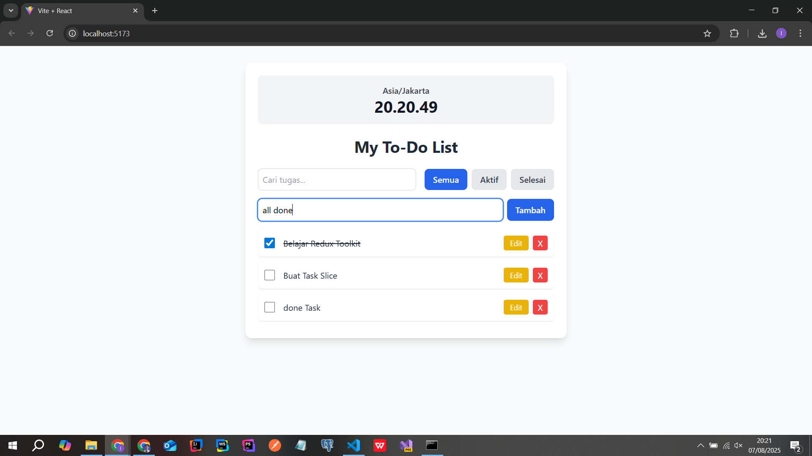

# Aplikasi To-Do List (Prototype)

Ini adalah aplikasi prototype to-do list yang dibuat sebagai bagian dari tantangan coding. Aplikasi ini sepenuhnya berjalan di sisi client (frontend) tanpa memerlukan backend.

## Screenshot Aplikasi



## Fitur yang Diimplementasikan

- [x] **Manajemen Tugas:** Tambah, Hapus, dan Edit tugas.
- [x] **Status Tugas:** Tandai tugas sebagai "selesai" atau "aktif".
- [x] **Filter & Pencarian:** Filter tugas berdasarkan status (semua, aktif, selesai) dan cari berdasarkan kata kunci.
- [x] **Integrasi API Eksternal:** Menampilkan widget jam yang datanya diambil dari World Time API.
- [x] **Animasi Loading:** Menampilkan indikator loading saat menambah tugas atau mengambil data dari API.
- [x] **Drag and Drop:** Mengurutkan daftar tugas menggunakan drag-and-drop (hanya aktif saat tidak ada filter).

## Teknologi yang Digunakan

- **Framework:** React (dengan Vite)
- **State Management:** Redux Toolkit & Redux-Saga
- **Styling:** Tailwind CSS
- **API Client:** Axios
- **Fitur Tambahan:** React Beautiful DnD

## Cara Menjalankan Proyek Secara Lokal

1.  **Clone repository ini:**
    ```bash
    git clone <url-repository-anda>
    ```
2.  **Masuk ke direktori proyek:**
    ```bash
    cd <nama-folder-proyek>
    ```
3.  **Install semua dependensi:**
    ```bash
    npm install
    ```
4.  **Jalankan server development:**
    ```bash
    npm run dev
    ```
5.  Buka browser dan navigasi ke `http://localhost:5173` atau alamat yang tertera di terminal.